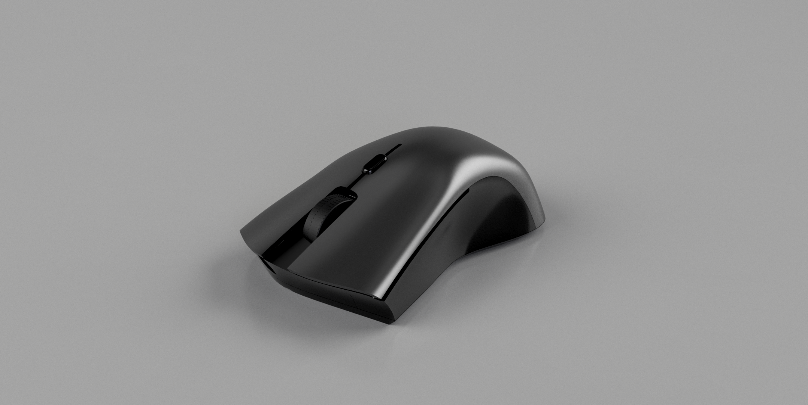

# Mouse

Computer mouse from scratch.

This repository serves as an appendix to my master thesis.

New features and bugfixes won't be added to this repository.
I plan on separating different parts of the repository into
a bigger project sometime in the future. If you come across
this repository before I do that, feel free to open an issue here.

## Overview

This repository contains blueprints for building a computer mouse.

### PCB

The pcb is made using Kicad with components from LCSC, to support assembly service from JLCPCB.

[more](pcb/)

### Housing

Housing (or case) is designed in Fusion360 and is meant to be 3D printed using SLS (also available on JLCPCB).

[more](housing/)

### Firmware

First iteration of the firmware was written in C using libopencm3 library.
Due to a lack of higher level ergonomics and support for board specific abstractions,
it was later re-written in Rust.

The new version of firmware is split into 2 parts:

- **Drivers for various components** (e.g. sensor, encoder...) are exposed as a library using embedded-hal
  traits as abstraction. It is intended to be portable across different hardware and possibly used in
  other mouse-related projects.
- **Board specific implementation** is essentially just glue-code between hardware specifics and modules
  from the forementioned library.

[more - C](firmware-c/)

[more - Rust](firmware-rust/)
